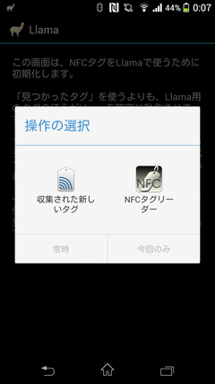
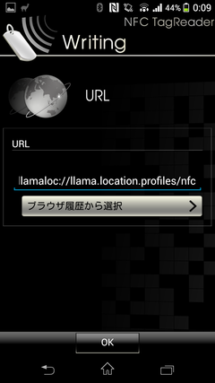
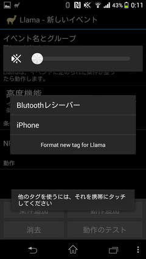
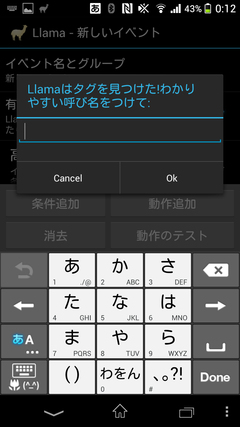
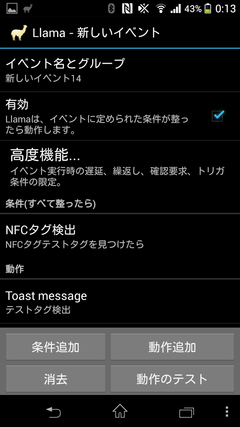
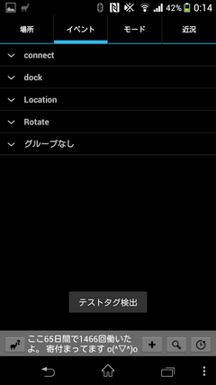

Llama便利ですね！
もっと便利に使うためにNFCタグを買ってみたものの、初期化出来なくて約2,000円が無駄になったとさめざめと泣いていましたが、なんとか解決出来たので記しておきます。

<!-- more -->

と言っても、任意のNFCタグライターでURLとして`llamaloc://llama.location.profiles/nfc`を書き込むだけです。

その後同様に以下の画面を表示させてNFCタグをタッチすると、

おめでとうございます！タグを見つけられたようです！

これを"テストタグ"と命名し、トーストメッセージを出す条件を入れてみます。

無事、トーストメッセージが表示されました！

以上です。
