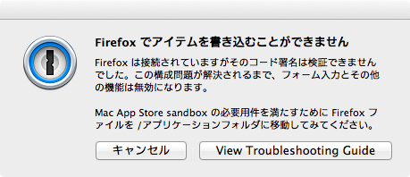
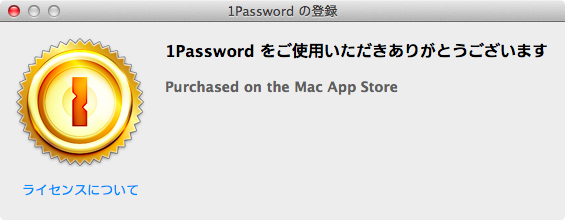

homebrew-cask、とても便利ですね！
管理出来るApplicationは全部homebrew-caskで管理したくなります。

ところが、ブラウザをcaskで入れ直して1password(Mac App Store版)でパスワードを入力しようとすると、



と怒られてしまいました。どうやらセキュリティのため、Mac App Store経由でインストールしたアプリからはcask管理ディレクトリ(`/opt/homebrew-cask/Caskroom/`)にアクセスできない様です。

$ neko
nyan

<!-- more -->

これはつらい！1passwordだけでなくブラウザまでもcaskで管理できない！と、解決法を調べていたところ、1passwordのサポートサイトに「Mac App Store版の購入の証明をしてくれればAgilebits store版のライセンスを発行するよ！」と書いてあった[^agilebits_license]ので、サポート[^support]に連絡してみました。英語があれすぎてあれなのでやりとりの概要だけ載せておきます。

1通目
=======
サンドボックスが邪魔なのでAgilebits store版が使いたい旨、証拠になりそうな物として以下の3ファイルを添付

1. Mac App Storeの"購入済み"画面のスクリーンショット
2. Mac App Store版の動作画面のスクリーンショット
3. Mac App Storeで決済時に届いたメール

返信
====
証拠はそれで良いよ、って事と情報登録の為にフルネームを教えてね、との事

2通目
====
お礼、フルネーム送信

返信
====
ライセンスつくったので直ぐにもう一通メール送るよ

てな感じで2往復、6時間くらいでライセンスを発行してもらえました。

で、

```{.sh}
$$ brew cask install onepassword
```



登録できてcaskで管理しているブラウザとの連携も確認できました。

とても迅速で丁寧に対応していただけたので、Mac Appstore版を購入済みでhomebrew caskユーザーの方は連絡してみれば良いと思います。

[^support]: [We're Here to Help!](http://learn.agilebits.com/1Password4/Mac/en/contact-us.html#e-mail)

[^agilebits_license]: [The fun stuff about 1Password 4's Sales and Licensing](http://learn.agilebits.com/1Password4/1p4-sales-faqs.html#can-i-switch-the-license-i-bought-from-agilebits-store-to-mac-app-store-or-the-other-way-around)
