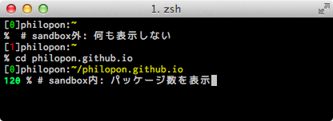

表題の通りです。
sandbox中のパッケージ数を表示させてます。

ついでにsandbox中でsandbox外のパッケージを使用したい事はまずないので、(やや過激ですが)`ghc-pkg`,`runhaskell`,`runghc`,`ghc`,`ghci`をsandbox中で実行した時はsandbox内のパッケージを使用する様にしてみました。便利。

<!-- more -->

[haskell.zsh](https://github.com/philopon/.zsh.d/blob/e7eb4e5540e41655814406087c226905e72c4aa8/haskell.zsh)
:    関数定義、ghcコマンド群のエイリアス設定
[prompt.zsh](https://github.com/philopon/.zsh.d/blob/e7eb4e5540e41655814406087c226905e72c4aa8/haskell.zsh#L17-L32)
:    プロンプトの設定

