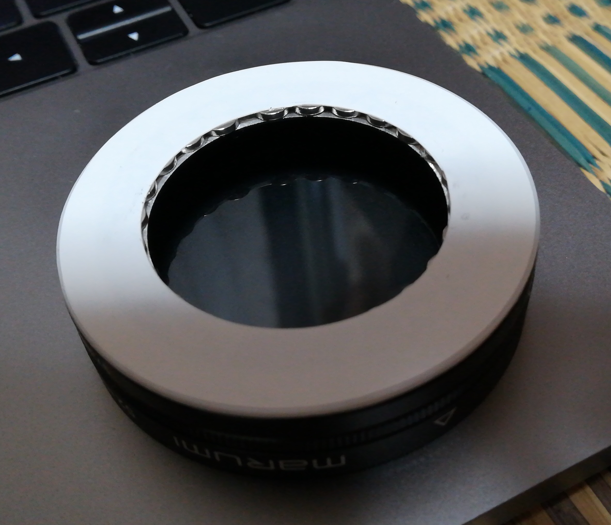

## はじめに

RX100にフィルター付けたい欲が過去最高を迎えた。

無印なので純正アクセサリーとかmagfilterとかが使えるけれど、あまり食指が動かない。

### 純正

* 先っぽの出っぱりがヤバくない……？
* magfilterより安いとは言え、複数のフィルターをいちいちネジネジして使わない為には 2,451 * n のマネーが発生する

### magfilter

* クソ高い。クッソ高い。

で、丁度自作しようって気分になった。

### 方針

* 磁石で付ける
* カメラ本体の厚みの増加を最小限に抑える
* なるべく安く

って感じ。

## ブツ

買ったブツは以下のとおり。浪費を戒めるために使ってないブツも買いてあるので、適宜読み飛してね。

アフィリエイトとか貼ってないので安心してリンク踏んでね。

### 部品

* [磁石](https://www.amazon.co.jp/gp/product/B073TWKXZV/ref=oh_aui_detailpage_o06_s00?ie=UTF8&psc=1) 1,398円
* [スチールシート](http://www.yodobashi.com/product/100000001001857436/?_ga=2.6709298.188445471.1505320874-1348388828.1499703705) 277円
* [ステップアップリング 37mm-52mm](http://www.yodobashi.com/product/000000110189602024/?_ga=2.71068688.188445471.1505320874-1348388828.1499703705) @429 * 4 = 1,716円
* [プラ板 0.5mm](http://www.yodobashi.com/product/100000001001740536/?_ga=2.2401456.188445471.1505320874-1348388828.1499703705) 596円 … 加工が不安だったので0.5mmを2枚重ねて使ったけれど (実際0.5mmにして良かった)、1mm切れる道具が有ればそれで良い。
* [プラペーパー 0.1mm](http://www.yodobashi.com/product/100000001001680947/?_ga=2.60203821.188445471.1505320874-1348388828.1499703705) 424円 … ちょっと薄すぎた感じがするのでもうちょっと厚くても良いかも

### 工具とか
* [ラッカー](http://www.yodobashi.com/product/100000001002114099/?_ga=2.170287264.188445471.1505320874-1348388828.1499703705) 516円 … ツヤ消し黒にしたけれど、完全にマットな質感なのでツヤ有りの方が良いかもしれない
* [コンパスカッター](http://www.yodobashi.com/product/100000001000435722/?_ga=2.96362524.188445471.1505320874-1348388828.1499703705) 501円 … 後述のダイソーので十分なので不要だった
* [紙やすり 荒目](http://www.yodobashi.com/product/000000677302203340/?_ga=2.268273550.188445471.1505320874-1348388828.1499703705) 160円 … 使わない
* [紙やすり 細目](http://www.yodobashi.com/product/000000677302203357/?_ga=2.268273550.188445471.1505320874-1348388828.1499703705) 160円 … 使わない
* [紙やすり 仕上げ](http://www.yodobashi.com/product/000000677302203364/?_ga=2.268273550.188445471.1505320874-1348388828.1499703705) 202円 … 2000番使う。

#### ダイソー
* コンパスカッター 108円 … 刃はクソだけれど、干渉部分削るとオルファの刃が入って神
* 金属用やすり(2種類) 216円 … なるべくデカい奴と細かい部分用に小さめのやつ
* ステンレスものさし 108円 … 我が家にはものさしすら存在しなかった
* キーケース 162円 … 完全にピッタリ。DIYの醍醐味って感じだ

#### 家にあったもの
* ボンド ウルトラ多用途SUソフト … 硬化が早くて使いにくかった。セメダインのやつ (こっちは10分とか放置してから使うみたいなので作業しやすそう)のが良さそう。
* the cell 細胞の分子生物学 第5版 … 高級枕。質量が有るので重しに使用
* カッターナイフ

## カメラに付ける部分の作成

ものぐさなので途中経過の写真は無い。

たぶんmagfilterのmetal ringも使えるので+5,000した方が質感は良いのでは (私は微妙にZEISSとかが見えてるのが嫌なので……

1. スチールシートをコンパスカッターでドーナツ状に切り抜く

    内径35mm、外径42mmくらい。まず紙とか切ってサイズ決めてからやると良いと思う。

2. 表面の紙を剥ぐ

    使ったスチールシートは紙(白) - なにか(グレー) - 金属 (金属の色だ) の三層になってた。
    グレーのやつまで剥いで金属は剥がないのは難しそうだったので、紙だけ剥いだ。

    カッターナイフの背とか適当な固い物を押し当ててゴシゴシ擦ると剥げる。

3. 塗装

    何も言う事はない。3度塗りした

4. 磨く

    2000番くらいのサンドペーパーで磨いてザラザラしてるのをどうにかする。

4. 貼る。

    裏面はシールになっている (結構粘着力有ったので多分大丈夫) ので、そのままカメラに貼る

完成形はこんな感じ。質感が合ってなかったり、一部端の方で金属が見えてたり、剥げそうなのが不満だけれど、
これ以上となると業者に頼んで黒色クロムめっきしたくなりそうなので妥協。

## アダプターの作成

1. ステップアップリングの出っぱり部分を削る

    これを

    

    こうじゃ

    

    完全に地獄 (4枚目でだいぶ慣れて来ていても30分アニメが見られる位の時間が掛かった) のでマネーで解決した方が良い

2. 0.5mmプラ板をドーナツ状に切り抜く (2枚)

    外径はステップアップリングと同じくらい (ちょっと小さめが良い)、
    内径はその中に5mmの磁石を入れるので、その位マージンを取って。

3. プラ板同士、プラ板とステップアップリングを接着する

4. 磁石を貼る

    磁石が結構強力なのでつらい。

    本とかにスチールシート貼って磁石を並べてから接着剤付けて、
    やすりとかに磁石を付けさせて貼っていくとスムーズ

    ここまででこんな感じ

    

5. 0.1mmプラペーパーをドーナツ状に切り抜く (1枚)

    外径はステップアップリングに貼ったプラ板より少し小さいくらい、
    内径は磁石をカバーできる位

6. プラペーパーを貼る

    完成だ

    

    
    

## おまけ: ケース

ダイソーで完全にピッタリなキーケースを見つけたのでやった。

1. キーケースのアイデンティティを喪失させる

    カッターでもいだ。後で接着剤でベタベタにするし良いであろう。

    

2. 適当にプラ板とスチールシートを切って、貼り合わせる

    スチールシートをドーナツ状にして、その内側に丸いプラ板を貼っておけば位置合わせできる

3. それをキーケースに貼り付ける

    

4. 中隔に使うプラ板を雰囲気でカットする

    ゴムを通す穴を明けておく

5. ゴムで中隔をまんなか生やす。

    裁縫なんて久しぶりにしたのでクソ難しかった……

    

## まとめ

* 結局6k越えているが、まぁアダプター4つとケース込みの値段なので良しとする。
* テストのために写真を取ると道具を揃えても写真の腕は上がらない事を痛感する。
* 紅葉とか撮りたい。
